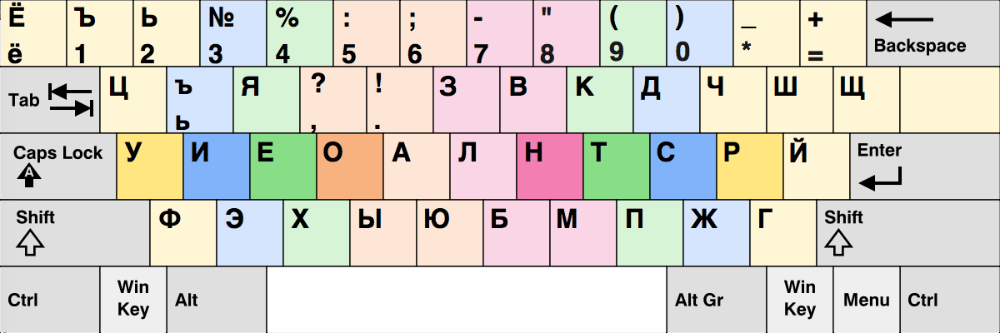

# Адаптированная раскладка __диктор__ под __colemak dh__

----------------------------------------------------------
## Действия по устранению проблем с созданием файлов клавиатуры
Кажется, что системы с 8.3 именами файлов (или короткими именами файлов) вызывают эту конкретную проблему.

Поскольку папка установки находится в программных файлах и содержит пробелы в каталоге приложения, MSKLC преобразует короткие имена файлов для успешной компиляции требуемых данных.

Отключение коротких имен приводит к сбою системы при создании файла клавиатуры.

Для устранения этой проблемы необходимо переместить или установить MSKLC в другую папку, в которой нет коротких имен.

Чтобы решить проблему с созданием файла клавиатуры, MSKLC должен находиться по пути, аналогичному C: msklc .
